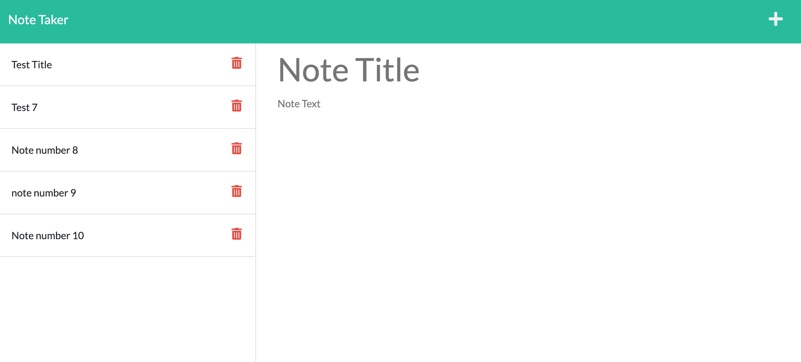
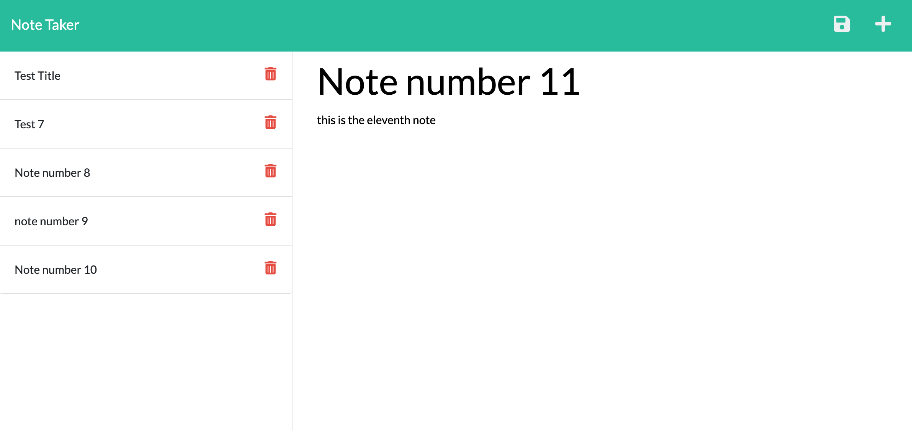

# Noteworthy_Notes

## Description 
This application allows a user to write notes and save them to a database. Upon opening the application, the user is taken to a home page with a button to launch the note taking app. This button takes the user to a page where they can begin writing and saving individual notes. Once a note has been saved, it then appears in a list inside of a column on the left-hand side of the page. The user has the ability to view individual previously saved notes by clicking on them. 

Future development on this application will allow the user to delete notes from the database that they no longer need, but time constraints prevented adding this functionality. 

## Screenshot 
The screenshots below show the app in use during testing once functionality had been successfully tested:

## Links

link to application deployed using heroku: https://noteworthy-notes-vd.herokuapp.com/

link to GitHub repository: https://github.com/dejuliusvince/Noteworthy_Notes

